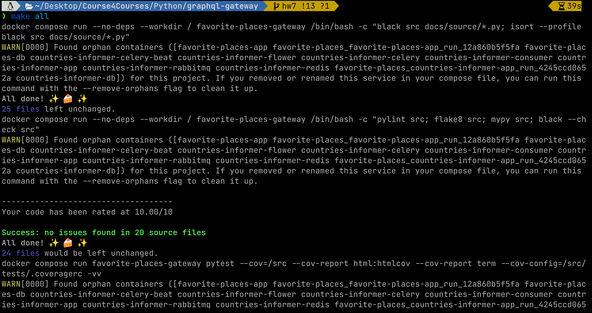
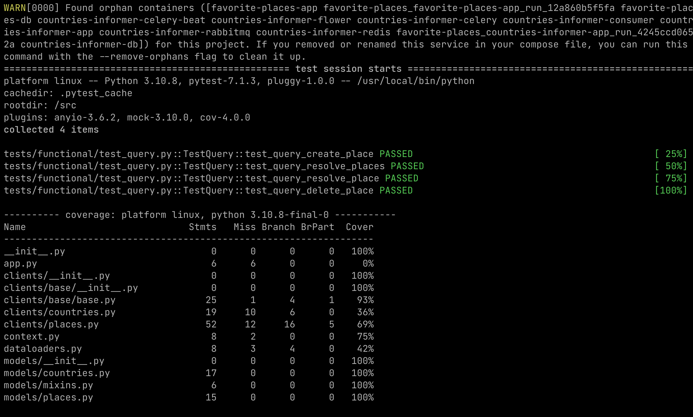
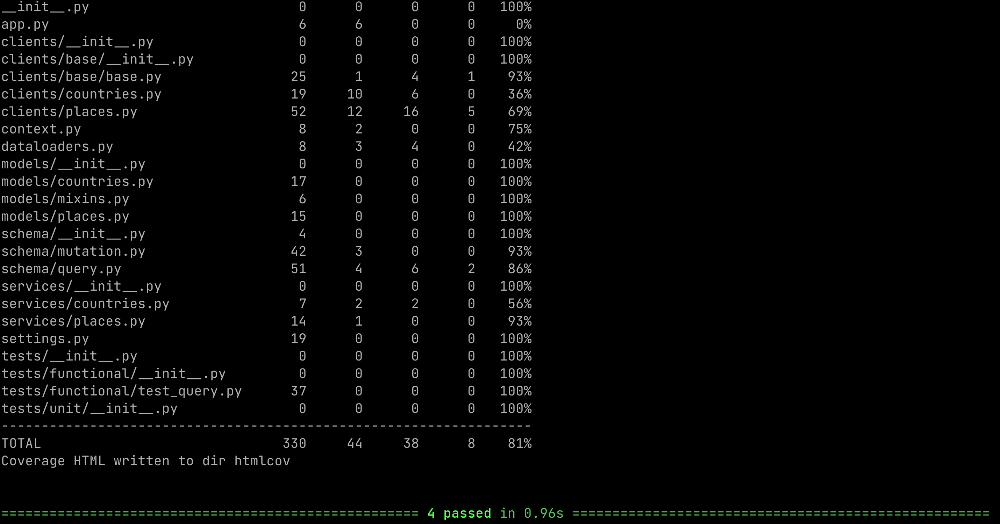
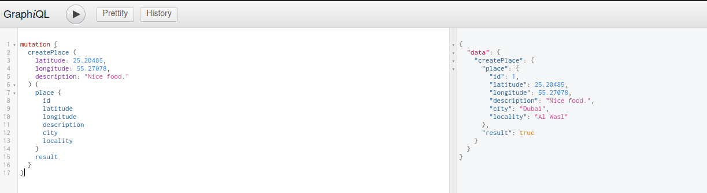
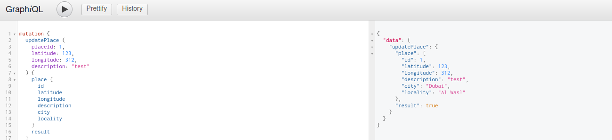
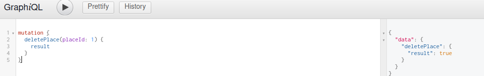

# Table of Contents

1.  [make all](#org29b3c87)
    1.  [Asciicinema](#org45d3dbf)
    2.  [Photo](#orge76d9b9)
2.  [grapql](#org762d4cc)
    1.  [create](#org55928f0)
    2.  [update](#org15cccc8)
    3.  [delete](#orgac29540)

# make all

## Asciicinema

## Photo

# grapql

## create

## update

## delete

